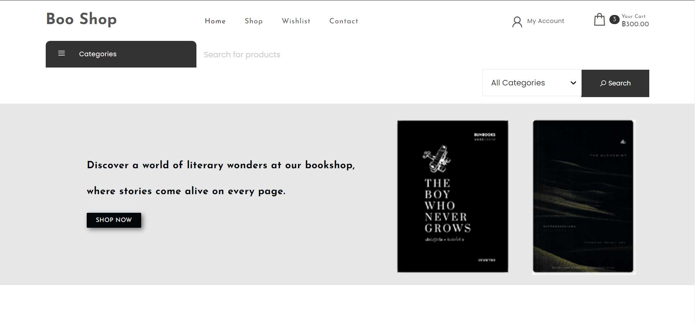
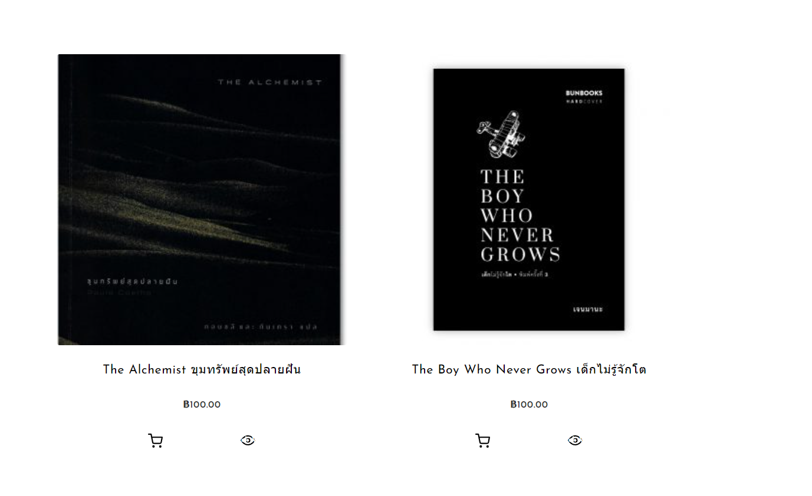
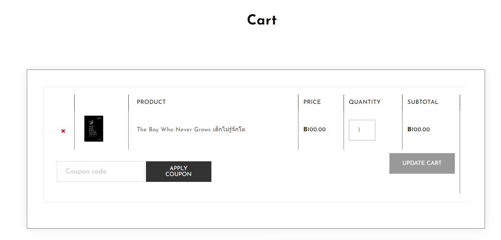

# Modern-Ecommerce-Platforms
Design and Develop Modern Ecommerce Plafform  
Bukhoree Sohprajin

## *Abstract*
This project revolves around the development of Boo Shop's E-Commerce Website. Leveraging WordPress and WooCommerce, the platform offers a seamless and secure book-buying experience. This document provides an overview of the project, detailing its objectives, key features, and the value it brings to customers. It also includes a Business Process Model and Notation (BPMN) representation, elucidating the intricate processes that underpin the website's functionality. This project aims to create a user-centric online bookstore, bridging the gap between traditional and digital book shopping.

## 1. Introduction
In a world where shopping is going digital, Boo Shop is going online. This project is all about introducing Boo Shop's E-Commerce Website, where we're bringing the charm and variety of our physical store to the internet.

Our E-Commerce Website, powered by WordPress and WooCommerce, is all about making book shopping easy. This introduction gives you a quick look at what we aim to achieve and how we're connecting the online and book-buying worlds.

In the following sections, we delve into the project's methods, technologies, and strategies, aiming to create an engaging and user-friendly online bookstore. Through this project, Boo Shop reaffirms its commitment to promoting the love for literature in the digital age.

## 2. Method
My project leverages a pre-existing theme as the foundation for Boo Shop's E-Commerce Website. The theme is **Own Shope version: 1.2 By Spiracle Themes.** This theme comes equipped with essential design and user interface (UI) elements, product catalog features, responsive design, and more. We've tailored and enhanced this theme to meet our specific requirements, focusing on the following aspects:

**2.1 Customization and Branding:** I customized the theme's appearance to align with Boo Shop's brand identity, ensuring a cohesive and visually appealing online presence.

**2.2 Plugin Integration:** I integrated key plugins like WooCommerce, PDF Invoices & Packing Slips, 2C2P Redirect API for WooCommerce, and Opn Payments to extend the theme's functionality.

**2.3** ...............................

## Plugin
- WooCommerce
- Elementor
- PDF Invoices & Packing Slips for WooCommerce
- 2C2P Redirect API for WooCommerce
- Opn Payments
  
## Theme
Own Shope version: 1.2   
By Spiracle Themes

## BPMN Diagram

This BPMN diagram show my E-Commerce Website processes, showcasing key interactions and workflows that enhance the platform's user-friendly online bookstore experience.

## All Pools in BPMN
- Customer
- Website
- Banking system
- 2C2P
- Shipping company

### Customer pool

- **Customer Pool:** Represents the group of customers interacting with the platform.

- **Start Event (Green Circle):** Marks the beginning of the customer's journey on the platform.

- **Make an Order Process:** Encompasses the steps related to creating an order.

  - **Select Products:** The customer selects the desired products from the available options.

      

  
  - **Add to Cart:** The selected products are added to the customer's shopping cart.

      

- **Check Out Process:** The process to Checkout the product. 

  - **Fill the shipping detail:** The customer fill their shipping detail.

      
  
  - **Identify payment method:** Payment information, such as credit card details, is entered.

      
  
  - **Make a payment:** In my website have 2 paymant method are banking tranfer and 2C2P.  

      
     

- **Send payment proof:** If the customer choose banking tranfer, they have to sent the photo of payment. but If the customer use 2C2P, they no need to sent the proof.
- **Order Completed:** The final step indicating that the order has been successfully placed.

### Website pool
- pppp
- ppp
 
### Banking system pool
 dasdsadsadsa, sadsadsa.

### 2C2P pool
dasdsad dsadasdsad
dasda

### Shipping company
its sdasdsda, dsadasdas. 

## Author
Bukhoree Sohprajin - 631431003
