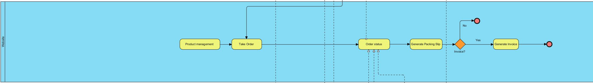

# Modern-Ecommerce-Platforms
Design and Develop Modern Ecommerce Plafform  
Bukhoree Sohprajin

## *Abstract*
This project revolves around the development of Boo Shop's E-Commerce Website. Leveraging WordPress and WooCommerce, the platform offers a seamless and secure book-buying experience. This document provides an overview of the project, detailing its objectives, key features, and the value it brings to customers. It also includes a Business Process Model and Notation (BPMN) representation, elucidating the intricate processes that underpin the website's functionality. This project aims to create a user-centric online bookstore, bridging the gap between traditional and digital book shopping.

## 1. Introduction
In a world where shopping is going digital, Boo Shop is going online. This project is all about introducing Boo Shop's E-Commerce Website, where we're bringing the charm and variety of our physical store to the internet.

Our E-Commerce Website, powered by WordPress and WooCommerce, is all about making book shopping easy. This introduction gives you a quick look at what we aim to achieve and how we're connecting the online and book-buying worlds.

In the following sections, we delve into the project's methods, technologies, and strategies, aiming to create an engaging and user-friendly online bookstore. Through this project, Boo Shop reaffirms its commitment to promoting the love for literature in the digital age.

## 2. Software and Tools Used
**2.1 Laragon:** [Laragon](https://laragon.org/why-laragon/) is utilized as our local development environment, providing a convenient platform for building and testing the Boo Shop E-Commerce Website before deployment.

**2.2 WordPress:** [WordPress](https://th.wordpress.org/) serves as the primary content management system (CMS) for our website, offering a flexible and user-friendly environment for managing web content.

**2.3 WooCommerce:** [WooCommerce](https://woocommerce.com/) is integrated seamlessly with WordPress, empowering our website with e-commerce capabilities, including product management, shopping cart functionality, and secure payment processing.

**2.4 Elementor:** [Elementor](https://elementor.com/) Elementor is a versatile page builder plugin employed to streamline the design process. It allows for easy customization of layouts and visual elements, enhancing the website's aesthetics and functionality.

**2.5 PDF Invoices & Packing Slips for WooCommerce:** [PDF Invoices & Packing Slips for WooCommerce](https://wordpress.org/plugins/woocommerce-pdf-invoices-packing-slips/) is responsible for generating professional invoices and packing slips for customer orders, ensuring a smooth and professional shopping experience.

**2.6 2C2P Redirect API for WooCommerce:** I've incorporated the [2C2P Redirect API](https://developer.2c2p.com/docs) to facilitate secure payment processing. It enables our customers to choose from various payment options, enhancing their convenience.

**2.7 Opn Payments:** [Opn Payments](https://et.wordpress.org/plugins/omise/) has been integrated to expand our payment gateway options, providing customers with even more flexibility in how they pay for their purchases.

**2.8 Contact Form 7:** [Conract From 7](https://th.wordpress.org/plugins/contact-form-7/") can manage multiple contact forms, plus you can customize the form and the mail contents flexibly with simple markup. The form supports Ajax-powered submitting, CAPTCHA, Akismet spam filtering and so on.

**2.9 Chaty:** [Chaty](https://wordpress.org/plugins/chaty/") is a Floating Chat Widget plugin that user can click on link to get more contact with the website

## 3. Method
My project leverages a pre-existing theme as the foundation for Boo Shop's E-Commerce Website. The theme is **Own Shope version: 1.2 By Spiracle Themes.** This theme comes equipped with essential design and user interface (UI) elements, product catalog features, responsive design, and more. We've tailored and enhanced this theme to meet our specific requirements, focusing on the following aspects:

**3.1 Customization and Branding:** I customized the theme's appearance to align with Boo Shop's brand identity, ensuring a cohesive and visually appealing online presence.

**3.2 Plugin Integration:** I integrated key plugins like WooCommerce, PDF Invoices & Packing Slips, 2C2P Redirect API for WooCommerce, and Opn Payments to extend the theme's functionality.

**3.3 Content management:** My project leverages the robust content management capabilities of WordPress and WooCommerce to efficiently organize and maintain our book inventory. Here are some key aspects of content management within our Boo Shop E-Commerce Website:
- Product Listings: Each book in my inventory is treated as a content item within WordPress. This allows me to create detailed listings for each book, including titles, authors, descriptions, cover images, prices, and more.
- Categories and Genres: WordPress and WooCommerce enable me to categorize and tag books based on genres, authors, and other relevant criteria. This categorization ensures that customers can easily navigate and discover books within my online store.
- Inventory Tracking: I use WooCommerce inventory management features to keep track of the availability of each book. This includes marking books as "in stock" or "out of stock," with automatic updates on the website.
- Content Updates: WordPress allows for easy updates to book descriptions, reviews, and other content elements. This ensures that our website provides up-to-date and accurate information to our customers.
- User-Generated Content: Customers can contribute to my content by leaving reviews and ratings for books they've purchased. WordPress handles the submission and display of these user-generated content pieces.

  
## 4. Visual Overview
Explore my Boo Shop E-Commerce Website through visual representations. This section includes a BPMN diagram outlining key processes and step-by-step screenshots of my website to provide a visual insight into the user experience and functionality.

### 4.1 Website overview
**HomePage**

**Shoppage**

**Cart**

### 4.2 BPMN Diagram

This BPMN diagram show my E-Commerce Website processes, showcasing key interactions and workflows that enhance the platform's user-friendly online bookstore experience.

#### All Pools in BPMN
- Customer
- Website
- Banking system
- 2C2P
- Shipping company

#### Customer pool
Represents the group of customers interacting with the platform.

- **Start Event (Green Circle):** Marks the beginning of the customer's journey on the platform.

- **Select Products:** The customer selects the desired products from the available options.
  
  
  
- **Add item to cart:** after select product process, customer will check in the cart. If the customer is satisfied with the selected product. they will go to checkout process. If not they will go back and select more item.

  
      
- **Checkout Process:** The process to Checkout the product. 

  - **Fill the shipping detail:** The customer fill their shipping detail.

      
  
  - **Identify payment method:** customer choose the payment method. In my wetsite have 2 ways are 2C2P, and Bank transfer.

      
      
 - **Payment process:** The customer make a payment on what they choose (2C2p or Bank transfer). For Bank transfer, customer have to sent the payment proof to admin by using contact form to sent photo or customer can sent via messenger, Line, E-mai. For 2C2P payment, no need to sent payment proof to admin. because when customer make a payment it will show in website that customer already pay.

      
     

- **Review order process:** In this process, customer can chect that the order is success or not. If not success, the order will cancel. If order is success, customer just wait for order to shipping.

- **Recieve the  product process:** Recieve the product from shipping company.

- **End Event (Red Circle)**

#### Website pool

- **Check slip and confirm order process:** This process admin will check the slip of payment and confirm order.

  
  
  

- **Correct gataway:** when admin check correctness about payment. If correct, It will go to Check Stock process. If not correct, It will cancel the order.
  
- **Check Stock process:** admin will check stock. If have product enough, It will go to next process (Prepare order for shipping process). If out of stock, the order will cancel.
  
- **Ship order to shipping company process:** This process is about sent product to shipping company.
  
 
#### 2C2P pool

 
 
- **Payment Authorization:** Initial step to check if the payment details are valid and funds are available.
  
- **Transaction Verification:** Ensures the transaction details are correct and match the customer's intentions.

- **Transaction Confirmation:** Final step that confirms the successful payment, allowing the merchant to fulfill the order.

- **Successful gataway:** If everything success, In website will show complete status. If not success, payment will failed.

- **End event**

#### Banking system pool

- **Payment Authorization Received:** Start event.

- **Payment Authorization:** The initial step where the bank verifies the customer's identity and ensures they have sufficient funds for the transfer.

- **Transaction Processing:** Once authorized, the bank processes the transfer, moving the funds from the sender's account to the recipient's account.

- **Successful gataway:** If everything success, In website will show complete status. If not success, payment will failed.

- **End event**

#### Shipping company pool

- **Receive Order for Shipment:** Start event.

- **Package Label Generation:** Creating shipping labels with package details.

- **Package Handover:** Sent product to customer by delivery man.

- **Order Tracking:** Real-time monitoring of package status.

- **Delivery Confirmation:** Confirming successful package delivery.

- **End event**

## 5. Conclusion

Boo Shop's E-Commerce Website is a testament to the power of digital transformation in the world of bookselling. By combining the flexibility and user-friendly nature of WordPress and WooCommerce with careful customizations and strategic plugin integrations, we've created an online bookstore that mirrors the charm and diversity of our physical store.

## Author
Bukhoree Sohprajin  
631431003 Fatoni University
